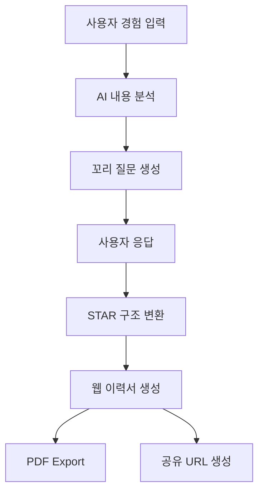

# 🚀 ResumeForge

> AI와 대화하며 만드는 이력서 빌더

ResumeForge는 사용자의 파편화된 경험과 메모를 기업이 선호하는 **STAR(Situation, Task, Action, Result)** 구조의 전문적인 이력서로 자동 변환해주는 AI 기반 이력서 생성 플랫폼입니다.

단순히 문장을 생성하는 것이 아니라, AI가 사용자에게 추가 질문을 던지며 부족한 정보를 수집하고 정량화된 성과 중심의 이력서 작성 과정을 지원합니다.

---

## 📌 프로젝트 소개

취업 준비생들은 자신의 경험을 효과적으로 표현하는 데 어려움을 겪습니다.

ResumeForge는 사용자가 의식의 흐름대로 작성한 메모를 기반으로 AI가 추가 질문을 생성하고, 이를 통해 수집된 정보를 STAR 구조로 정리하여 전문적인 이력서로 변환합니다.

### 기존 방식

- 경험 정리 어려움
- 성과 수치화 부족
- 이력서 작성 시간 소모
- 작성 품질 편차 발생

### ResumeForge

- 자유롭게 경험 입력
- AI 기반 꼬리 질문 생성
- 성과 중심 STAR 구조 자동 변환
- 실시간 웹 이력서 생성
- PDF 및 공유 링크 제공

---

# ✨ 주요 기능

## 1. 자유 입력 메모장 (Raw Input)

사용자는 부담 없이 경험을 자유롭게 작성합니다.

예시:

```text
캡스톤 프로젝트에서 팀장을 맡았고,
노션 세팅해서 팀원들이 같이 작업했고,
앱을 출시했는데 다운로드도 어느 정도 나왔음
```

---

## 2. AI 꼬리 질문 생성

AI가 부족한 정보를 분석하여 추가 질문을 생성합니다.

예시:

- 앱 다운로드 수는 몇 회였나요?
- 노션 도입 후 협업 효율은 얼마나 개선되었나요?
- 팀원은 총 몇 명이었나요?

---

## 3. STAR 구조 자동 변환

AI가 수집된 정보를 바탕으로 전문적인 이력서 문장으로 재구성합니다.

### Situation

프로젝트 배경과 문제 상황

### Task

사용자의 역할과 책임

### Action

문제 해결을 위한 행동 및 기술적 접근

### Result

정량화된 성과 및 배운 점

---

## 4. 실시간 이력서 렌더링

생성된 결과를 즉시 웹 이력서 형태로 확인할 수 있습니다.

지원 예정 기능:

- 웹 포트폴리오 링크 공유
- PDF 다운로드
- 다크 모드 지원
- 반응형 UI

---

# 🏗️ 서비스 플로우



---

# 🛠️ 기술 스택

## Frontend

- Next.js 16
- React 19
- TypeScript
- Tailwind CSS v4
- shadcn/ui

### 활용 예정 기술

- Server Actions
- next/form
- useTransition
- useActionState

---

## Backend

- Supabase
  - Authentication
  - PostgreSQL Database
  - Storage

---

## AI

- Gemini Flash API

---

# 📷 프로젝트 화면

추후 추가 예정

- 로그인 화면
- 경험 입력 화면
- AI 질문 인터페이스
- STAR 결과 화면
- 이력서 미리보기 화면

---

# 📄 License

MIT License

---
